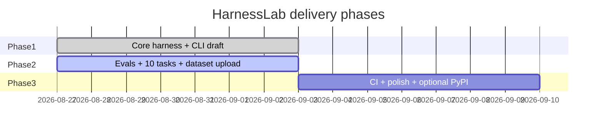
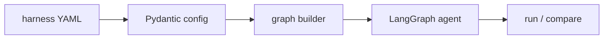
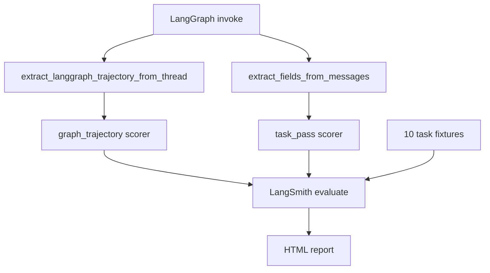
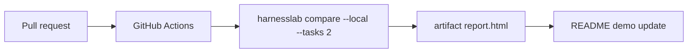
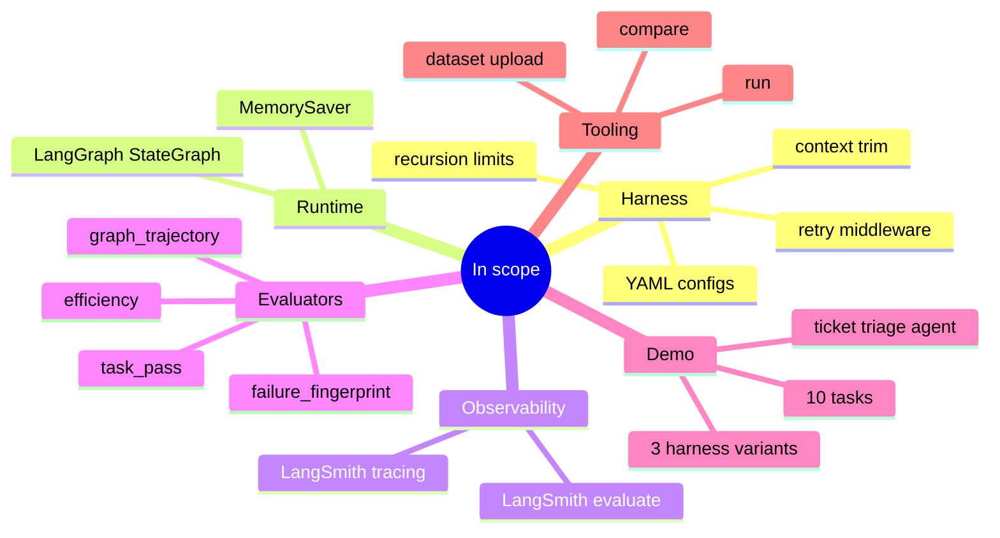
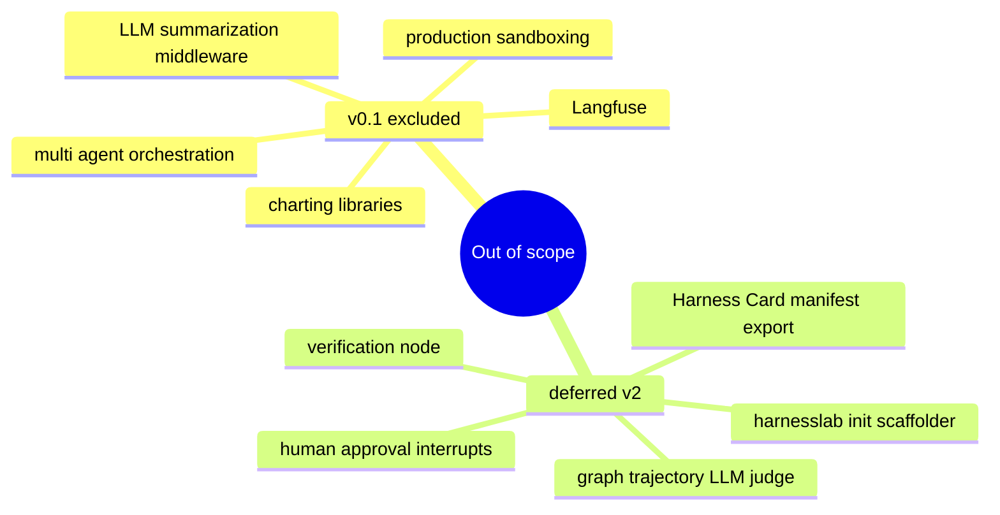
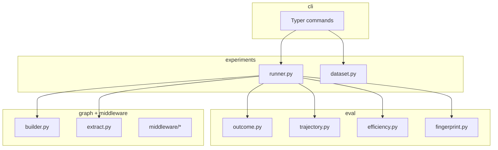
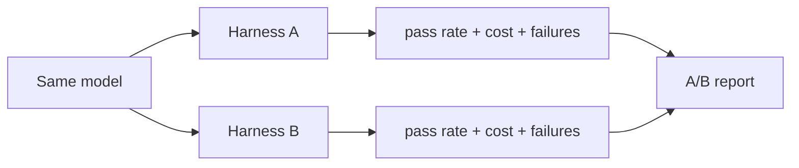

# HarnessLab Implementation Plan

Project phases, scope boundaries, and delivery checklist.

## Phase overview

## Phase 1 — Core harness (complete)

| Deliverable | Status |
|---|---|
| Package layout (`config`, `graph`, `middleware`, `eval`, `cli`) | done |
| Harness YAML schema + loader | done |
| Middleware: limits, retry, context trim | done |
| Ticket triage example agent | done |
| `harnesslab run` + `harnesslab compare` | done |
| HTML comparison report | done |
| README with architecture diagrams | done |

## Phase 2 — Evals and dataset (current)

| Deliverable | Status |
|---|---|
| Graph trajectory extraction via agentevals | done |
| `graph_trajectory` evaluator (node subsequence match) | done |
| Tool output parsing for `task_pass` | done |
| 10 ticket fixtures + 10 task JSON files | done |
| `harnesslab dataset upload` command | done |
| `--tasks` limit flag for smoke runs | done |
| Unit tests for trajectory + extraction | done |

## Phase 3 — Portfolio polish (next)

| Deliverable | Status |
|---|---|
| GitHub Actions smoke workflow | pending |
| README demo GIF or recorded output | pending |
| Optional PyPI publish | pending |
| Verification middleware (`verify.py`) | deferred |
| Human-in-the-loop interrupts | deferred |
| Persistent checkpointer sessions | deferred |

## Scope matrix

### In scope

### Out of scope

## Architecture boundaries

| Module | Owns | Does not own |
|---|---|---|
| `config/` | YAML schema + validation | graph compile |
| `graph/` | state, edges, builder, extract | tools, prompts |
| `middleware/` | harness node behavior | eval logic |
| `eval/` | scorer functions | experiment orchestration |
| `experiments/` | LangSmith run/upload | scorer implementation |
| `report/` | HTML formatting | experiment execution |
| `cli/` | argument parsing | business logic |
| `examples/` | demo agent + fixtures | library internals |

## Code hygiene rules

| Rule | Target |
|---|---|
| Module size | max ~150 lines |
| Function size | max ~25 lines |
| File docs | module docstring required |
| Function docs | public functions documented |
| Comments | no single-line `#` comments |
| Separation | CLI stays thin, logic in packages |

## Research motivation

HarnessLab makes harness configuration explicit so benchmark gains are not misattributed to model improvements alone.

References:
- [Stop Comparing LLM Agents Without Disclosing the Harness](https://arxiv.org/html/2605.23950)
- [Harness-Bench](https://doi.org/10.48550/arxiv.2605.27922)
- [Scaffold Effect in Coding Agents](https://kdd-eval-workshop.github.io/agenticai-evaluation-kdd2026/assets/papers/74_The_Scaffold_Effect_in_Codi.pdf)

## Commands by phase

| Phase | Command |
|---|---|
| 1 | `harnesslab run examples/ticket_triage --harness minimal` |
| 1 | `harnesslab compare examples/ticket_triage --local` |
| 2 | `harnesslab dataset upload examples/ticket_triage` |
| 2 | `harnesslab compare examples/ticket_triage --tasks 2 --local` |
| 3 | CI smoke via GitHub Actions |

## Success criteria

- [x] Phase 1 core harness + CLI
- [x] Phase 2 graph trajectory evals + 10 tasks
- [ ] Phase 3 CI workflow
- [ ] Phase 3 optional PyPI publish
