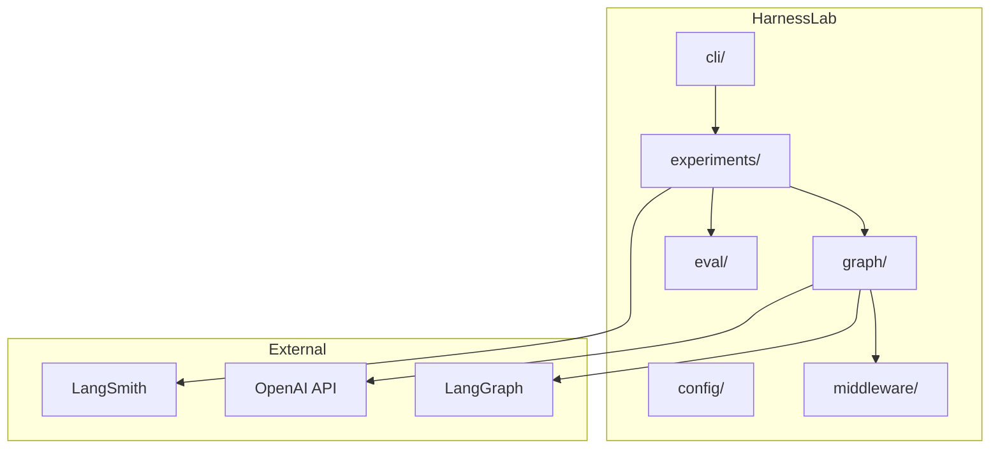
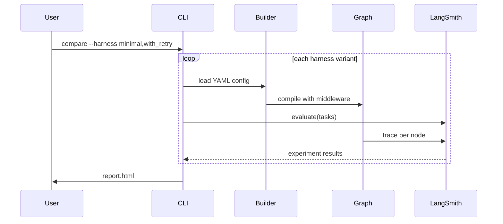
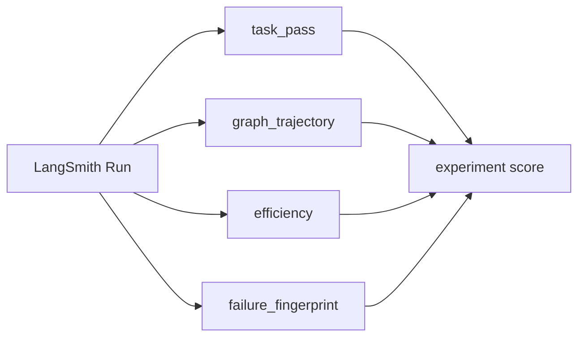
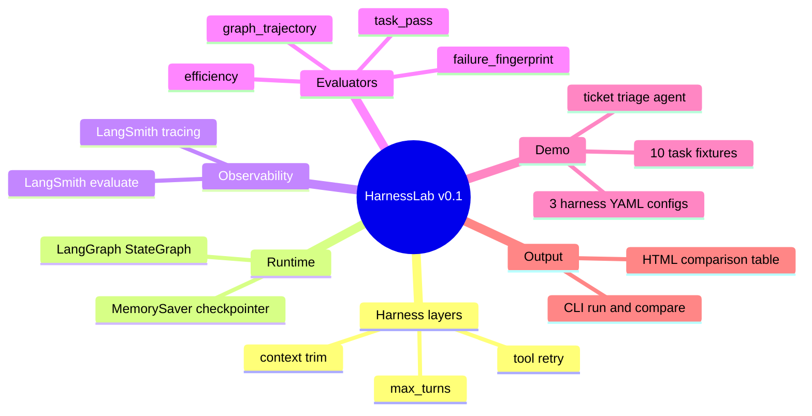
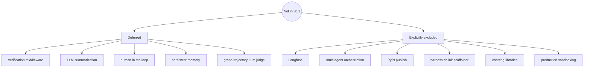

# HarnessLab

> Declare harness variants as YAML. Run LangGraph A/B experiments. Score with LangSmith.

See [IMPLEMENTATION_PLAN.md](IMPLEMENTATION_PLAN.md) for phased delivery, scope, and architecture boundaries.


## Quick start

```bash
cd harnesslab
python -m venv .venv && source .venv/bin/activate
pip install -e ".[dev]"

export OPENAI_API_KEY=...
export LANGSMITH_API_KEY=...
export LANGSMITH_TRACING=true

harnesslab compare examples/ticket_triage --local -o report.html
```

## Architecture



## Harness A/B flow



## Example agent


| Tool | Purpose |
|---|---|
| `read_ticket` | Load ticket from fixtures |
| `search_kb` | Match KB articles |
| `classify` | Assign category |
| `draft_reply` | Write customer reply |

## Harness configs

| Variant | `max_turns` | `retry_count` | `history_limit` |
|---|---|---|---|
| `minimal` | 10 | 0 | none |
| `with_retry` | 15 | 2 | none |
| `with_context_trim` | 15 | 0 | 8 |

## Evaluators



| Evaluator | Type | Measures |
|---|---|---|
| `task_pass` | deterministic | correct category + reply terms |
| `graph_trajectory` | deterministic | expected graph nodes in order |
| `efficiency` | deterministic | latency, tokens, steps |
| `failure_fingerprint` | deterministic | TIMEOUT / TOOL_ERROR / WRONG_ANSWER / SUCCESS |

## CLI

```bash
harnesslab run examples/ticket_triage --harness minimal
harnesslab compare examples/ticket_triage --harness minimal,with_retry --output report.html
harnesslab compare examples/ticket_triage --local --tasks 2
harnesslab dataset upload examples/ticket_triage --name harnesslab-ticket-triage
```

## In scope (v0.1)



## Out of scope (v0.1)



## Project layout

```
harnesslab/
├── harnesslab/
│   ├── config/         # YAML schema + loader
│   ├── graph/          # builder, state, edges
│   ├── middleware/     # retry, context, limits
│   ├── eval/           # LangSmith scorers
│   ├── experiments/    # runner + task loader
│   ├── report/         # HTML output
│   └── cli/            # typer commands
├── examples/ticket_triage/
│   ├── graph.py        # demo agent
│   ├── tools.py
│   ├── harnesses/      # YAML variants
│   ├── tasks/          # eval fixtures
│   └── fixtures/       # mock data
└── tests/
```

## Environment

| Variable | Required | Default |
|---|---|---|
| `OPENAI_API_KEY` | yes | — |
| `LANGSMITH_API_KEY` | yes (unless `--local`) | — |
| `LANGSMITH_TRACING` | recommended | `true` |
| `HARNESSLAB_MODEL` | no | `gpt-4o-mini` |

## Research context

Harness choice is a hidden variable in agent benchmarks. HarnessLab makes harness config explicit and measurable — same model, different harness, compare in LangSmith.

## License

MIT
