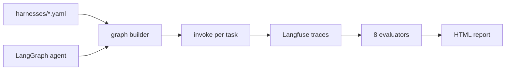

# HarnessLab

[](https://github.com/HOSH19/HarnessLab/actions/workflows/ci.yml)

A/B test **agent harnesses** (retries, context trim, turn limits) and **models** on the same LangGraph ticket-triage agent. Declare variants in YAML, run stress tasks, score with custom evaluators, and compare results in an HTML report or Langfuse.

## What it does

HarnessLab answers: *did harness X beat harness Y on task Z, and why?*

1. Load harness config from YAML (`minimal`, `retry`, `trim`, …)
2. Compile a LangGraph agent with harness middleware applied
3. Run each stress task and trace execution in Langfuse
4. Score runs with eight evaluators (correctness, trajectory, efficiency, …)
5. Write `report.html` and persist JSON under `.harnesslab/runs/`



## Quick start

```bash
git clone https://github.com/HOSH19/HarnessLab.git && cd HarnessLab

# Install (conda or pip)
conda env create -f environment.yml && conda activate harnesslab
# or: pip install -e ".[dev]"

cp .env.example .env
# Set OPENAI_API_KEY and, for upload mode, LANGFUSE_PUBLIC_KEY + LANGFUSE_SECRET_KEY
```

Run locally (no Langfuse credentials required):

```bash
python -m harnesslab compare examples/ticket_triage --local -o report.html
```

Upload traces and scores to Langfuse:

```bash
python -m harnesslab compare examples/ticket_triage -o report.html
```

> **CLI tip:** If `harnesslab` is not found after `pip install`, use `python -m harnesslab` or add user scripts to PATH: `export PATH="$HOME/.local/bin:$PATH"`.

## Commands

| Command | Purpose |
|---|---|
| `run` | Run one harness against stress tasks |
| `compare` | Compare harnesses or models; writes `report.html` |
| `dataset upload` | Sync local task fixtures to a Langfuse dataset |

### Examples

```bash
# Single harness, one task (cheapest Langfuse upload)
python -m harnesslab run examples/ticket_triage --harness minimal --tasks 1

# Harness compare — default: minimal + retry × 2 tasks
python -m harnesslab compare examples/ticket_triage --local -o report.html

# Model compare on one harness (nano, mini, turbo)
python -m harnesslab compare examples/ticket_triage --by models --harness minimal --local

# One stress ticket
python -m harnesslab compare examples/ticket_triage --task T-018 --local

# Named Langfuse dataset
python -m harnesslab dataset upload examples/ticket_triage --name triage-v2
python -m harnesslab compare examples/ticket_triage --dataset triage-v2 -o report.html
```

## Harness variants

Defined in `examples/ticket_triage/harnesses/`:

| Harness | Middleware | Use case |
|---|---|---|
| `minimal` | none | Baseline — no retries, no trimming |
| `retry` | tool retries (×2) | Recover from flaky tool calls |
| `trim` | message history cap | Long-context stress tasks |

Agent policy: `examples/ticket_triage/rules.py` — read ticket → search KB → classify → draft reply (plus optional SLA/escalation tools).

## Stress suite

Nine tasks (`T-011`–`T-019`) under `examples/ticket_triage/tasks/`:

- Flaky tool recovery
- Long conversation history
- SLA / escalation paths
- Adversarial prompts
- Tool budget pressure

Filter with `--task T-018` or cap with `--tasks N` (default: 2).

## Evaluators

Each run is scored on eight dimensions:

| Evaluator | What it measures |
|---|---|
| `task_pass` | Correct category + required reply terms |
| `graph_trajectory` | Expected node subsequence |
| `tool_sequence` | Tool call order |
| `error_recovery` | Tool errors vs acceptable limit |
| `step_count` | Agent/tool steps vs budget |
| `efficiency` | Latency, tokens, and step penalty |
| `failure_fingerprint` | Failure category (timeout, tool error, wrong answer, …) |
| `reply_text` | Draft reply for human review |

## Compare modes

| `--by` | Varies | Fixed |
|---|---|---|
| `harness` (default) | Harness YAML (`minimal`, `retry`) | Model from `HARNESSLAB_MODEL` |
| `models` | Cheap models (`nano`, `mini`, `turbo`) | Single `--harness` |

Default model arms: `gpt-4.1-nano`, `gpt-4.1-mini`, `gpt-3.5-turbo`. Override with `--models nano,mini`.

## Langfuse integration

Without `--local`, HarnessLab:

- Traces each graph invocation via `langfuse.langchain.CallbackHandler`
- Runs experiments with `langfuse.run_experiment()` / `dataset.run_experiment()`
- Uploads evaluator scores as Langfuse feedback
- Tags traces with harness name and project (`langfuse_project` in harness YAML)

**Logged fields** (minimal set for A/B debugging): `harness_name`, `classification`, `final_reply`, `graph_trajectory`, `error_count`. See [docs/LOGGING_FIELDS.md](docs/LOGGING_FIELDS.md).

| Goal | Command | Langfuse usage |
|---|---|---|
| Iterate locally | `--local` | No upload |
| Cheapest upload | `--task T-018` | 2 experiments × 1 task |
| Default upload | (no flags) | 2 harnesses × 2 tasks |

In the Langfuse UI, open **Datasets → Experiments** to compare runs side by side, or drill into individual traces for the full agent loop (`agent` → `tools` → `ChatOpenAI` spans).

## Environment

| Variable | Required | Default |
|---|---|---|
| `OPENAI_API_KEY` | yes | — |
| `LANGFUSE_PUBLIC_KEY` | yes (unless `--local`) | — |
| `LANGFUSE_SECRET_KEY` | yes (unless `--local`) | — |
| `LANGFUSE_HOST` | self-hosted only | Langfuse Cloud |
| `HARNESSLAB_MODEL` | no | `gpt-4.1-nano` |

Self-hosted Langfuse: set `LANGFUSE_HOST` to your instance URL.

## Project layout

```
harnesslab/           # Core package (CLI, evaluators, experiment runner)
examples/
  ticket_triage/      # Demo agent, harnesses, and stress tasks
docs/                 # LOGGING_FIELDS, DEMO, run analysis notes
.harnesslab/runs/     # Local experiment JSON (gitignored)
```

## Development

```bash
pip install -e ".[dev]"
pytest -q
```

## Further reading

- [docs/DEMO.md](docs/DEMO.md) — example compare output
- [docs/LOGGING_FIELDS.md](docs/LOGGING_FIELDS.md) — observability field inventory
- [IMPLEMENTATION_PLAN.md](IMPLEMENTATION_PLAN.md) — architecture and scope

## License

MIT
