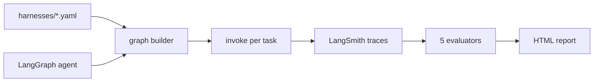

# HarnessLab

[](https://github.com/HOSH19/HarnessLab/actions/workflows/ci.yml)

A/B test **agent harnesses** (retries, context trim, turn limits) and **models** on LangGraph agents. Declare variants in YAML, run stress tasks, score with evaluators, compare in `report.html` or LangSmith.

## What it does

*Did harness X beat harness Y on task Z, and why?*



Harness variants: `minimal` (baseline), `retry` (tool retries), `trim` (history cap). The same three presets work for every example — only the `langsmith_project` name changes per agent.

| Example | Path | Tasks | Difficulty |
|---|---|---|---|
| Research agent | `examples/research_agent/` | `R-001`–`R-004` (4 tasks) | Easier — linear search → read → classify → reply |
| Incident manager | `examples/incident_manager/` | `I-101`–`I-106` (6 tasks) | Harder — contradictory metrics, adversarial prompts, timeline correlation |

## Quick start

```bash
git clone https://github.com/HOSH19/HarnessLab.git && cd HarnessLab
./scripts/install.sh
cp .env.example .env   # OPENAI_API_KEY; LANGSMITH_API_KEY for upload mode
```

Local (no LangSmith credentials):

```bash
python -m harnesslab compare examples/research_agent --local -o report.html
```

LangSmith upload:

```bash
python -m harnesslab run examples/research_agent --harness minimal --tasks 2 --dataset research-ablation
```

Use `--local` while iterating; drop it when you want traces and experiment history in LangSmith.

## Commands

| Command | Purpose |
|---|---|
| `run` | One harness × N tasks |
| `compare` | Harness or model A/B → `report.html` |
| `dataset upload` | Sync tasks to a LangSmith dataset |

```bash
# Easier example — research agent (default: minimal + retry × 1 task)
python -m harnesslab compare examples/research_agent --local -o report.html

# Harder example — incident manager
python -m harnesslab compare examples/incident_manager --local -o incident-report.html

# Model compare on one harness
python -m harnesslab compare examples/research_agent --by models --harness minimal --local

# Single task
python -m harnesslab compare examples/incident_manager --task I-103 --local
```

## Project layout

| Path | Role |
|---|---|
| `harnesslab/cli/` | Typer commands (`run`, `compare`, `dataset upload`) |
| `harnesslab/config/` | Harness YAML schema and env loading |
| `harnesslab/eval/` | Five LangSmith evaluators |
| `harnesslab/experiments/` | Dataset sync, runner, local result store |
| `harnesslab/graph/` | Shared LangGraph builder and middleware hooks |
| `examples/*/` | Drop-in agent examples with tasks and harness presets |

Docs: [EVALUATORS.md](docs/EVALUATORS.md) · [HARNESSES.md](docs/HARNESSES.md)

## License

MIT
