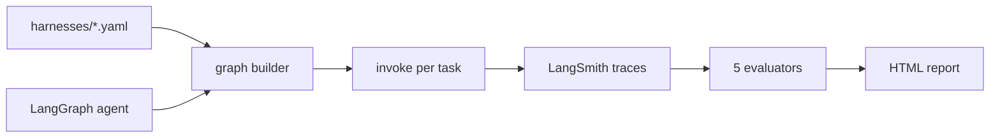
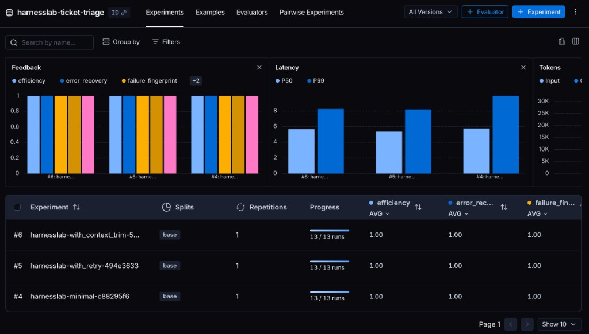
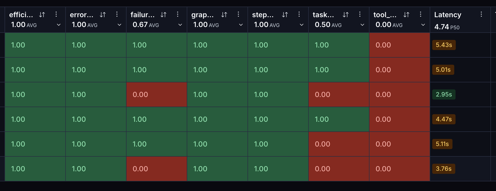
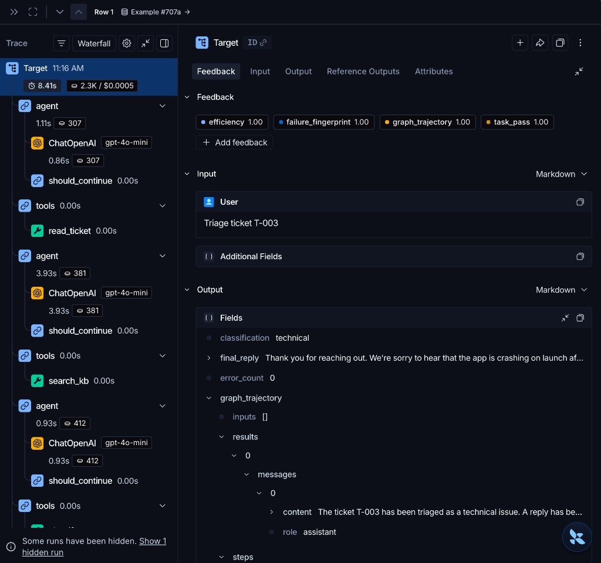

# HarnessLab

[](https://github.com/HOSH19/HarnessLab/actions/workflows/ci.yml)

A/B test **agent harnesses** (retries, context trim, turn limits) and **models** on the same LangGraph ticket-triage agent. Declare variants in YAML, run stress tasks, score with custom evaluators, and compare results in an HTML report or LangSmith.

## What it does

HarnessLab answers: *did harness X beat harness Y on task Z, and why?*

1. Load harness config from YAML (`minimal`, `retry`, `trim`, …)
2. Compile a LangGraph agent with harness middleware applied
3. Run each stress task and trace execution in LangSmith
4. Score runs with five evaluators (correctness, trajectory, recovery, efficiency, failure type)
5. Write `report.html` and persist JSON under `.harnesslab/runs/`



## LangSmith dashboard

Without `--local`, traces and scores live in LangSmith (project `triage`, dataset `ticket-triage-stress`). A local `report.html` is also written.

Three harness experiments on 9 stress tasks:



| Area | What you see |
|---|---|
| **Experiments** | One row per harness (`minimal`, `retry`, `trim`), 6/6 completed |
| **Feedback** | `efficiency` and `error_recovery` at 1.0 for all three; `failure_fingerprint` ~0.67 |
| **Latency** | `minimal` slowest (P50 ~9s); `retry` and `trim` faster (~4–5s P50) |
| **Tokens** | `minimal` uses far more input tokens than `retry` / `trim` |

Aggregate charts look even — drill into per-task rows for real differences.

### Per-task scores



In this `trim` run, `task_pass` averages **0.50** and `tool_sequence` **0.00** while `efficiency` / `error_recovery` stay at 1.0:

- **1.0 on efficiency / error_recovery** — run finished without crashing, not "got the right answer"
- **Below 1.0 on task_pass / tool_sequence** — wrong category, missing reply terms, or skipped tools
- Compare the same view across `minimal`, `retry`, and `trim` to see harness impact

### Agent loop trace



Trace for ticket **T-015** under the `trim` harness: `trim_context` → `agent` → `tools` (`read_ticket`, `search_kb`, `classify`, `draft_reply`) with flaky `search_kb` retries. The right panel shows evaluator scores and structured output (`classification`, `final_reply`, `graph_trajectory`).

## Quick start

```bash
git clone https://github.com/HOSH19/HarnessLab.git && cd HarnessLab

# Install (conda or pip)
conda env create -f environment.yml && conda activate harnesslab
# or: ./scripts/install.sh

cp .env.example .env
# Set OPENAI_API_KEY and, for upload mode, LANGSMITH_API_KEY
```

Run locally (no LangSmith credentials required):

```bash
python -m harnesslab compare examples/ticket_triage --local -o report.html
```

Upload traces and scores to LangSmith:

```bash
python -m harnesslab compare examples/ticket_triage -o report.html
```

> **CLI tip:** After `pip install`, run `./scripts/install.sh` once so `harnesslab` is on your PATH. You can also use `python -m harnesslab` or `./bin/harnesslab`.

## Commands

| Command | Purpose |
|---|---|
| `run` | Run one harness against stress tasks |
| `compare` | Compare harnesses or models; writes `report.html` |
| `dataset upload` | Sync local task fixtures to a LangSmith dataset |

### Examples

```bash
# Single harness, one task (cheapest LangSmith upload)
python -m harnesslab run examples/ticket_triage --harness minimal --tasks 1

# Harness compare — default: minimal + retry × 2 tasks
python -m harnesslab compare examples/ticket_triage --local -o report.html

# Model compare on one harness (nano, mini, turbo)
python -m harnesslab compare examples/ticket_triage --by models --harness minimal --local

# One stress ticket
python -m harnesslab compare examples/ticket_triage --task T-018 --local

# Named LangSmith dataset
python -m harnesslab dataset upload examples/ticket_triage --name triage-v2
python -m harnesslab compare examples/ticket_triage --dataset triage-v2 -o report.html
```

## Harness variants

Defined in `examples/ticket_triage/harnesses/`:

| Harness | Middleware | Use case |
|---|---|---|
| `minimal` | none | Baseline — no retries, no trimming |
| `retry` | tool retries (×2) | Recover from flaky tool calls |
| `trim` | message history cap | Long-context stress tasks |

Agent policy: `examples/ticket_triage/rules.py` — read ticket → search KB → classify → draft reply (plus optional SLA/escalation tools).

## Stress suite

Nine tasks (`T-011`–`T-019`) under `examples/ticket_triage/tasks/`:

- Flaky tool recovery
- Long conversation history
- SLA / escalation paths
- Adversarial prompts
- Tool budget pressure

Filter with `--task T-018` or cap with `--tasks N` (default: 2).

## Evaluators

Each run is scored on five dimensions. See [docs/EVALUATORS.md](docs/EVALUATORS.md) for full definitions.

| Evaluator | What it measures |
|---|---|
| `task_pass` | Correct category + required reply terms |
| `graph_trajectory` | Expected node subsequence |
| `error_recovery` | Tool errors vs acceptable limit |
| `efficiency` | Latency, tokens, and step penalty |
| `failure_fingerprint` | Failure category (timeout, tool error, wrong answer, …) |

## Compare modes

| `--by` | Varies | Fixed |
|---|---|---|
| `harness` (default) | Harness YAML (`minimal`, `retry`) | Model from `HARNESSLAB_MODEL` |
| `models` | Cheap models (`nano`, `mini`, `turbo`) | Single `--harness` |

Default model arms: `gpt-4.1-nano`, `gpt-4.1-mini`, `gpt-3.5-turbo`. Override with `--models nano,mini`.

## LangSmith integration

Without `--local`, HarnessLab:

- Traces each graph invocation via LangSmith's LangChain integration
- Runs experiments with `langsmith.evaluate()`
- Uploads evaluator scores as LangSmith feedback
- Tags traces with harness name and project (`langsmith_project` in harness YAML)

**Logged fields** (minimal set for A/B debugging): `harness_name`, `classification`, `final_reply`, `graph_trajectory`, `error_count`. See [docs/LOGGING_FIELDS.md](docs/LOGGING_FIELDS.md).

| Goal | Command | LangSmith usage |
|---|---|---|
| Iterate locally | `--local` | No upload |
| Cheapest upload | `--task T-018` | 2 experiments × 1 task |
| Default upload | (no flags) | 2 harnesses × 2 tasks |

In the LangSmith UI, open **Projects → Experiments** to compare runs, or drill into individual traces for the full agent loop (`agent` → `tools` → `ChatOpenAI` spans).

## Environment

| Variable | Required | Default |
|---|---|---|
| `OPENAI_API_KEY` | yes | — |
| `LANGSMITH_API_KEY` | yes (unless `--local`) | — |
| `LANGSMITH_ENDPOINT` | non-US accounts only | US default |
| `LANGSMITH_TRACING` | no | `true` |
| `HARNESSLAB_MODEL` | no | `gpt-4.1-nano` |

Non-US LangSmith accounts: set `LANGSMITH_ENDPOINT` (e.g. `https://apac.api.smith.langchain.com`).

## Project layout

```
harnesslab/           # Core package (CLI, evaluators, experiment runner)
examples/
  ticket_triage/      # Demo agent, harnesses, and stress tasks
docs/                 # LOGGING_FIELDS, DEMO, run analysis notes
.harnesslab/runs/     # Local experiment JSON (gitignored)
```

## Development

```bash
pip install -e ".[dev]"
pytest -q
```

## Further reading

- [docs/DEMO.md](docs/DEMO.md) — example compare output
- [docs/EVALUATORS.md](docs/EVALUATORS.md) — the five evaluator scores explained
- [docs/LOGGING_FIELDS.md](docs/LOGGING_FIELDS.md) — observability field inventory
- [IMPLEMENTATION_PLAN.md](IMPLEMENTATION_PLAN.md) — architecture and scope

## License

MIT
