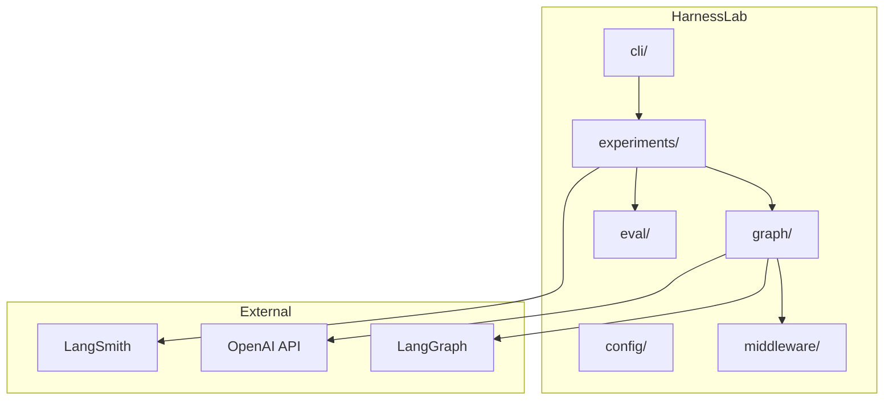
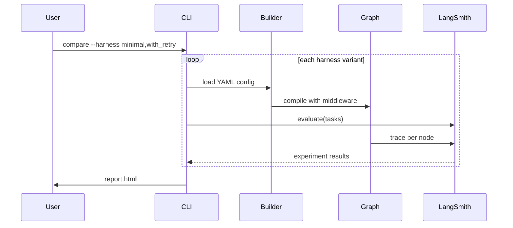
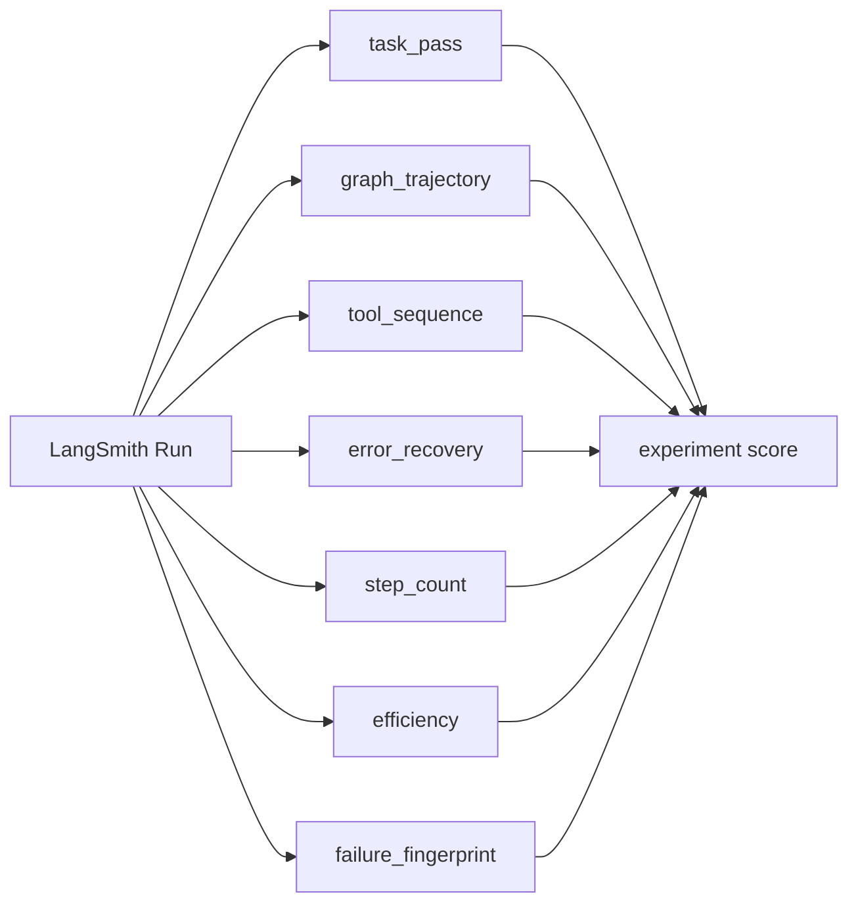
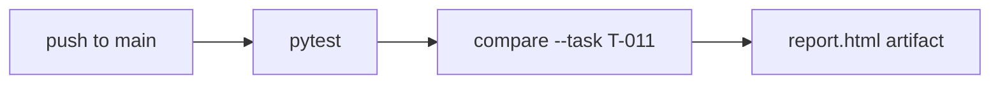

# HarnessLab

[](https://github.com/HOSH19/HarnessLab/actions/workflows/ci.yml)

HarnessLab is a small framework for **A/B testing agent harnesses and models** — the infrastructure around an LLM agent (retries, context limits, turn caps) and the model itself. You declare harness variants as YAML, run the same LangGraph agent under each configuration, score outcomes with LangSmith evaluators, and compare results across **models** or **harnesses** on stress tasks.

The demo is a support **ticket triage agent**: read a ticket, search the knowledge base, classify it, and draft a reply. Three harness configs (`minimal`, `with_retry`, `with_context_trim`) wrap the same graph with different middleware so you can see whether infrastructure choices actually matter.

See [IMPLEMENTATION_PLAN.md](IMPLEMENTATION_PLAN.md) for phased delivery notes and [docs/DEMO.md](docs/DEMO.md) for a local run walkthrough.

## How it works


1. **Harness YAML** defines execution limits, tool retry policy, and context trimming.
2. **Graph builder** compiles the LangGraph agent with the selected middleware.
3. **Runner** invokes the agent on each task and records traces in LangSmith.
4. **Evaluators** score every run (correctness, trajectory, efficiency, failure type).
5. **Compare** aggregates scores across harness variants into an HTML report.

## LangSmith dashboard

When you run `compare` **without** `--local`, every run is stored in LangSmith — traces, evaluator scores, latency, and token usage. HarnessLab does not maintain a separate database; LangSmith is the system of record. A local `report.html` is also written, but the dataset and experiments persist in your LangSmith project (`harnesslab-ticket-triage`) until you delete them.

The screenshot below shows three experiments (13 tasks each) — one per harness variant:


| UI area | What it shows |
|---|---|
| **Experiments tab** | All runs for this dataset. Each row is one harness variant. Progress `13/13` means every task completed. |
| **Feedback chart** | Average evaluator scores per experiment. Aggregate bars look similar because most tasks are easy — harness differences show up on stress tasks and in per-row drill-down. |
| **Latency chart** | P50 and P99 response time per harness. Here `with_context_trim` (#6) has the lowest P50; `minimal` (#4) has the highest P99. |
| **Tokens chart** | Input/output token usage per experiment. |
| **Experiment table** | Click a row to open per-task scores. Look at `task_pass` and `tool_sequence` averages — not just `efficiency` / `error_recovery`, which stay at 1.0 when runs finish cleanly. |

### Per-task scores

Click an experiment row to see **individual trial results**. This is where harness differences actually appear — aggregate charts smooth them out.


In this `with_context_trim` run, `task_pass` averages **0.69** and `tool_sequence` **0.77** — several tasks score 0.0 (red) even though experiment-level `error_recovery` and `efficiency` are 1.0. That pattern is expected:

- **`error_recovery` / `efficiency` / `failure_fingerprint` at 1.0** — the agent finished without crashing; these measure completion and resource use, not answer correctness.
- **`task_pass` / `tool_sequence` below 1.0** — the agent gave a wrong category, missed reply terms, or skipped a tool in the expected sequence.
- **Harness comparison** — open the same per-task view for `minimal` vs `with_retry` vs `with_context_trim` and compare rows 11–13 (stress tasks) side by side.

The local `report.html` mirrors this with a per-task breakdown table. **LangSmith is where traces live** — click any red row to open the full agent loop for that task.

### Agent loop trace

Click any experiment row, then a task run, to open the **trace view**. This is the full agent loop for a single task — the screenshot below shows task `T-003` under the `minimal` harness:


| UI area | What it shows |
|---|---|
| **Trace tree (left)** | The LangGraph execution tree. Each `agent` node is an LLM call (`gpt-4o-mini`); each `tools` node is a tool invocation (`read_ticket`, `search_kb`, `classify`, `draft_reply`). `should_continue` is the routing edge that decides whether to call more tools or stop. |
| **Feedback tab (right)** | Per-run evaluator scores for this task — `task_pass`, `graph_trajectory`, `efficiency`, and `failure_fingerprint`. |
| **Input** | The task prompt sent to the agent (`Triage ticket T-003`). |
| **Output** | What the agent produced: `classification`, `final_reply`, `error_count`, and the raw `graph_trajectory` message history. |

One task run typically looks like:

```
agent → tools (read_ticket) → agent → tools (search_kb) → agent → tools (classify) → agent → tools (draft_reply) → agent → end
```

Each `agent` step is the LLM deciding what to do next; each `tools` step executes that decision. The harness wraps this loop with retry middleware, context trimming, and turn limits — without changing the agent logic itself.

## Architecture



## Harness A/B flow



## Example agent

The ticket triage agent is a simple LangGraph loop: the LLM calls tools until it has classified the ticket and drafted a reply.


| Tool | Purpose |
|---|---|
| `read_ticket` | Load ticket from fixtures |
| `search_kb` | Match KB articles |
| `classify` | Assign category |
| `draft_reply` | Write customer reply |
| `check_sla` | Look up SLA tier and deadline |
| `escalate_ticket` | Escalate to senior support or engineering |

## Harness configs

| Variant | `max_turns` | `retry_count` | `history_limit` |
|---|---|---|---|
| `minimal` | 10 | 0 | none |
| `with_retry` | 15 | 2 | none |
| `with_context_trim` | 15 | 0 | 8 |

## Evaluators



| Evaluator | Measures |
|---|---|
| `task_pass` | Correct category + required reply terms |
| `graph_trajectory` | Expected graph nodes appear in order |
| `tool_sequence` | Expected tool calls appear in order (`read_ticket` → …) |
| `error_recovery` | `error_count` within acceptable limit (retry stress) |
| `step_count` | Child run count vs per-task step budget |
| `efficiency` | Latency, tokens, steps (tighter thresholds) |
| `failure_fingerprint` | TIMEOUT / TOOL_ERROR / WRONG_ANSWER / SUCCESS |

### Stress tasks (6)

All fixtures are stress scenarios (tickets T-011–T-016):

| File | Ticket | Scenario |
|---|---|---|
| **task-001** | T-011 | Flaky `read_ticket` (2 failures) |
| **task-002** | T-012 | 24+ message conversation history |
| **task-003** | T-013 | Ambiguous billing + account |
| **task-004** | T-014 | Two required `search_kb` calls |
| **task-005** | T-015 | Flaky `search_kb` (2 failures) |
| **task-006** | T-016 | SLA check + escalation (6 tools) |

## Compare modes

Use `--by` to choose the comparison dimension:

| `--by` | Varies | Fixed |
|---|---|---|
| **`harness`** (default) | Harness configs (`minimal`, `with_retry`, `with_context_trim`) | Model (`HARNESSLAB_MODEL` in `.env`) + stress tasks |
| **`models`** | Cheap models (`gpt-4.1-nano`, `gpt-4o-mini`, `gpt-3.5-turbo`) | Harness (`--harness minimal`) + stress tasks |

Filter to one ticket with `--task T-011`. Results are always saved locally under `.harnesslab/runs/` and optionally uploaded to LangSmith.

## Quick start

```bash
cd harnesslab
conda env create -f environment.yml
conda activate harnesslab
cp .env.example .env

# Compare harnesses on stress tasks (default, local)
harnesslab compare examples/ticket_triage --local -o report.html

# Single ticket, harness comparison
harnesslab compare examples/ticket_triage --task T-011 --local

# Compare cheap models on one harness
harnesslab compare examples/ticket_triage --by models --local

# LangSmith upload + local JSON archive
harnesslab compare examples/ticket_triage -o report.html
```

```bash
pytest -q
```

## CLI

```bash
harnesslab compare examples/ticket_triage
harnesslab compare examples/ticket_triage --by harness --harness minimal,with_retry
harnesslab compare examples/ticket_triage --by models --harness minimal
harnesslab compare examples/ticket_triage --task T-011
harnesslab compare examples/ticket_triage --by models --models gpt-4.1-nano,gpt-3.5-turbo
harnesslab run examples/ticket_triage --harness minimal --task T-011
harnesslab dataset upload examples/ticket_triage
```

## CI



| Job | Runs on | Needs |
|---|---|---|
| `unit-tests` | every push + PR | nothing |
| `smoke-compare` | push to `main` + manual dispatch | `OPENAI_API_KEY` secret |

Add `OPENAI_API_KEY` under **Settings → Secrets and variables → Actions** to enable the smoke job.

## Project layout

```
harnesslab/
├── harnesslab/
│   ├── config/         # YAML schema + loader
│   ├── graph/          # builder, state, edges
│   ├── middleware/     # retry, context, limits
│   ├── eval/           # LangSmith scorers
│   ├── experiments/    # runner + task loader
│   ├── report/         # HTML output
│   └── cli/            # typer commands
├── examples/ticket_triage/
│   ├── graph.py        # demo agent
│   ├── tools.py
│   ├── harnesses/      # YAML variants
│   ├── tasks/          # eval fixtures
│   └── fixtures/       # mock data
├── docs/images/        # README screenshots
└── tests/
```

## Environment

| Variable | Required | Default |
|---|---|---|
| `OPENAI_API_KEY` | yes | — |
| `LANGSMITH_API_KEY` | yes (unless `--local`) | — |
| `LANGSMITH_ENDPOINT` | yes for non-US accounts | `https://api.smith.langchain.com` |
| `LANGSMITH_TRACING` | recommended | `true` |
| `HARNESSLAB_MODEL` | no | `gpt-4.1-nano` |

Put these in a local `.env` file (gitignored) or export them in your shell.

**Recommended for cheap harness testing:** `HARNESSLAB_MODEL=gpt-4.1-nano` (set in `.env.example`). It costs less than `gpt-4o-mini` for tool-use loops and produces more variability — wrong categories, skipped tools, and turn-limit hits — which makes harness A/B differences easier to see. Use `gpt-4o-mini` when you want a more capable baseline.

If LangSmith returns **403 Forbidden**, your account is likely in a different region — set `LANGSMITH_ENDPOINT` to your regional API URL (e.g. `https://apac.api.smith.langchain.com` for APAC).

GitHub Actions uses repository secrets instead of `.env`.

## Research context

Harness choice is a hidden variable in agent benchmarks. HarnessLab makes harness config explicit and measurable — same model, different harness, compare in LangSmith.

## License

MIT
