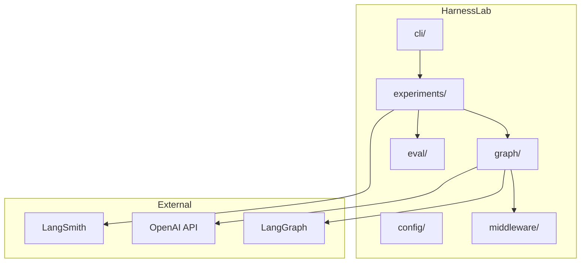
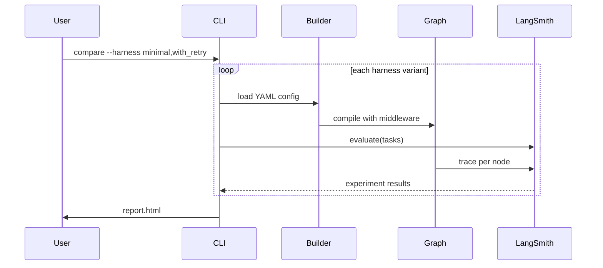
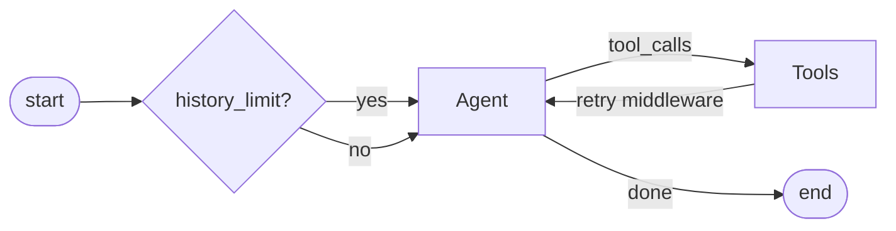
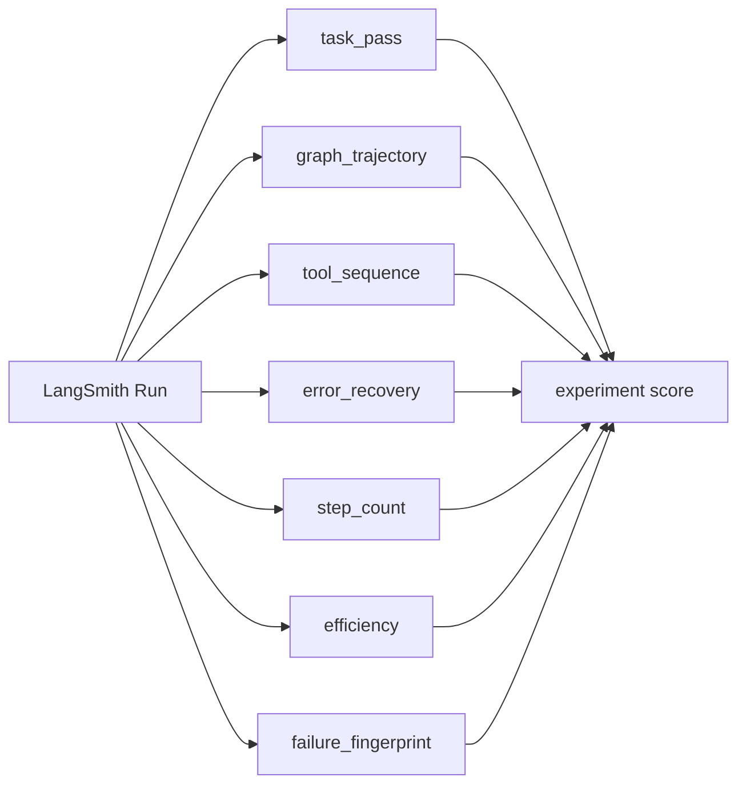
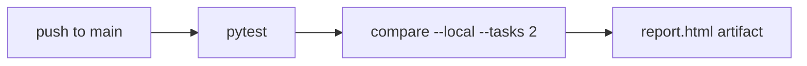

# HarnessLab

[](https://github.com/HOSH19/HarnessLab/actions/workflows/ci.yml)

HarnessLab is a small framework for **A/B testing agent harnesses** — the infrastructure around an LLM agent (retries, context limits, turn caps) rather than the agent logic itself. You declare harness variants as YAML, run the same LangGraph agent under each one, score outcomes with LangSmith evaluators, and compare results side by side.

The demo is a support **ticket triage agent**: read a ticket, search the knowledge base, classify it, and draft a reply. Three harness configs (`minimal`, `with_retry`, `with_context_trim`) wrap the same graph with different middleware so you can see whether infrastructure choices actually matter.

See [IMPLEMENTATION_PLAN.md](IMPLEMENTATION_PLAN.md) for phased delivery notes and [docs/DEMO.md](docs/DEMO.md) for a local run walkthrough.

## How it works


1. **Harness YAML** defines execution limits, tool retry policy, and context trimming.
2. **Graph builder** compiles the LangGraph agent with the selected middleware.
3. **Runner** invokes the agent on each task and records traces in LangSmith.
4. **Evaluators** score every run (correctness, trajectory, efficiency, failure type).
5. **Compare** aggregates scores across harness variants into an HTML report.

## LangSmith dashboard

When you run `compare` without `--local`, LangSmith hosts the full experiment view. The screenshot below shows three experiments on the `harnesslab-ticket-triage` dataset — one per harness variant.


| UI area | What it shows |
|---|---|
| **Experiments tab** | All runs for this dataset. Each row is one harness variant (`harnesslab-minimal`, `with_retry`, `with_context_trim`). |
| **Feedback chart** | Average evaluator scores per experiment. Here `task_pass` ≈ 0.67 (2 of 3 tasks correct); the other metrics are 1.0 because the agent completed without errors. |
| **Latency chart** | P50 and P99 response time per harness. `with_context_trim` is fastest here — trimming history reduced round-trip time even though correctness was unchanged. |
| **Tokens chart** | Input/output token usage per experiment — useful for spotting harnesses that bloat context. |
| **Experiment table** | Click any row to drill into individual task runs, full message traces, tool calls, and per-evaluator comments. |

The local `report.html` is a summary table. **LangSmith is where the detail lives** — per-run traces, node-by-node graph execution, and evaluator breakdowns.

### Agent loop trace

Click any experiment row, then a task run, to open the **trace view**. This is the full agent loop for a single task — the screenshot below shows task `T-003` under the `minimal` harness:


| UI area | What it shows |
|---|---|
| **Trace tree (left)** | The LangGraph execution tree. Each `agent` node is an LLM call (`gpt-4o-mini`); each `tools` node is a tool invocation (`read_ticket`, `search_kb`, `classify`, `draft_reply`). `should_continue` is the routing edge that decides whether to call more tools or stop. |
| **Feedback tab (right)** | Per-run evaluator scores for this task — `task_pass`, `graph_trajectory`, `efficiency`, and `failure_fingerprint`. |
| **Input** | The task prompt sent to the agent (`Triage ticket T-003`). |
| **Output** | What the agent produced: `classification`, `final_reply`, `error_count`, and the raw `graph_trajectory` message history. |

One task run typically looks like:

```
agent → tools (read_ticket) → agent → tools (search_kb) → agent → tools (classify) → agent → tools (draft_reply) → agent → end
```

Each `agent` step is the LLM deciding what to do next; each `tools` step executes that decision. The harness wraps this loop with retry middleware, context trimming, and turn limits — without changing the agent logic itself.

## Architecture



## Harness A/B flow



## Example agent

The ticket triage agent is a simple LangGraph loop: the LLM calls tools until it has classified the ticket and drafted a reply.



| Tool | Purpose |
|---|---|
| `read_ticket` | Load ticket from fixtures |
| `search_kb` | Match KB articles |
| `classify` | Assign category |
| `draft_reply` | Write customer reply |

## Harness configs

| Variant | `max_turns` | `retry_count` | `history_limit` |
|---|---|---|---|
| `minimal` | 10 | 0 | none |
| `with_retry` | 15 | 2 | none |
| `with_context_trim` | 15 | 0 | 8 |

## Evaluators



| Evaluator | Measures |
|---|---|
| `task_pass` | Correct category + required reply terms |
| `graph_trajectory` | Expected graph nodes appear in order |
| `tool_sequence` | Expected tool calls appear in order (`read_ticket` → …) |
| `error_recovery` | `error_count` within acceptable limit (retry stress) |
| `step_count` | Child run count vs per-task step budget |
| `efficiency` | Latency, tokens, steps (tighter thresholds) |
| `failure_fingerprint` | TIMEOUT / TOOL_ERROR / WRONG_ANSWER / SUCCESS |

### Stress tasks (11–13)

Three tasks are tagged `"stress": true` to expose harness differences without extra LLM cost:

| Task | Scenario | What diverges |
|---|---|---|
| **task-011** | `read_ticket` fails once (`flaky_tools`) | `with_retry` recovers; `minimal` may fail |
| **task-012** | 20-message conversation history | `with_context_trim` may drop early context |
| **task-013** | Ambiguous billing + account ticket | Stricter `task_pass` terms |

```bash
# Include stress tasks (tasks 11–13 are the last three)
harnesslab compare examples/ticket_triage \
  --harness minimal,with_retry,with_context_trim \
  --tasks 13 --local -o report.html
```

The HTML report now includes a **per-task breakdown** table below the summary averages.

## Quick start

```bash
cd harnesslab
conda env create -f environment.yml   # creates env + pip install -e ".[dev]"
conda activate harnesslab

# OR if env already exists:
# conda activate harnesslab && pip install -e ".[dev]"

cp .env.example .env
# edit .env with your keys (this file is gitignored)

# Local mode — no LangSmith upload, writes report.html
harnesslab compare examples/ticket_triage --local --tasks 3 -o report.html

# Full mode — uploads experiments to LangSmith (see dashboard above)
harnesslab compare examples/ticket_triage \
  --harness minimal,with_retry,with_context_trim \
  --tasks 3 \
  -o report.html
```

Verify install:

```bash
which python    # should point inside conda env
which pytest    # same env as python
pytest -q
```

## CLI

```bash
harnesslab run examples/ticket_triage --harness minimal
harnesslab compare examples/ticket_triage --harness minimal,with_retry --output report.html
harnesslab compare examples/ticket_triage --local --tasks 2
harnesslab dataset upload examples/ticket_triage --name harnesslab-ticket-triage
```

## CI



| Job | Runs on | Needs |
|---|---|---|
| `unit-tests` | every push + PR | nothing |
| `smoke-compare` | push to `main` + manual dispatch | `OPENAI_API_KEY` secret |

Add `OPENAI_API_KEY` under **Settings → Secrets and variables → Actions** to enable the smoke job.

## Project layout

```
harnesslab/
├── harnesslab/
│   ├── config/         # YAML schema + loader
│   ├── graph/          # builder, state, edges
│   ├── middleware/     # retry, context, limits
│   ├── eval/           # LangSmith scorers
│   ├── experiments/    # runner + task loader
│   ├── report/         # HTML output
│   └── cli/            # typer commands
├── examples/ticket_triage/
│   ├── graph.py        # demo agent
│   ├── tools.py
│   ├── harnesses/      # YAML variants
│   ├── tasks/          # eval fixtures
│   └── fixtures/       # mock data
├── docs/images/        # README screenshots
└── tests/
```

## Environment

| Variable | Required | Default |
|---|---|---|
| `OPENAI_API_KEY` | yes | — |
| `LANGSMITH_API_KEY` | yes (unless `--local`) | — |
| `LANGSMITH_ENDPOINT` | yes for non-US accounts | `https://api.smith.langchain.com` |
| `LANGSMITH_TRACING` | recommended | `true` |
| `HARNESSLAB_MODEL` | no | `gpt-4o-mini` |

Put these in a local `.env` file (gitignored) or export them in your shell.

If LangSmith returns **403 Forbidden**, your account is likely in a different region — set `LANGSMITH_ENDPOINT` to your regional API URL (e.g. `https://apac.api.smith.langchain.com` for APAC).

GitHub Actions uses repository secrets instead of `.env`.

## Research context

Harness choice is a hidden variable in agent benchmarks. HarnessLab makes harness config explicit and measurable — same model, different harness, compare in LangSmith.

## License

MIT
