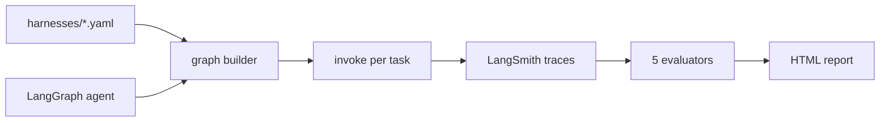

# HarnessLab

[](https://github.com/HOSH19/HarnessLab/actions/workflows/ci.yml)

A/B test **agent harnesses** (retries, context trim, turn limits) and **models** on the same LangGraph ticket-triage agent. Declare variants in YAML, run stress tasks, score with evaluators, compare in `report.html` or LangSmith.

## What it does

*Did harness X beat harness Y on task Z, and why?*



Harness variants: `minimal` (baseline), `retry` (tool retries), `trim` (history cap). Nine stress tasks (`T-011`–`T-019`) in `examples/ticket_triage/tasks/`.

## Quick start

```bash
git clone https://github.com/HOSH19/HarnessLab.git && cd HarnessLab
./scripts/install.sh
cp .env.example .env   # OPENAI_API_KEY; LANGSMITH_API_KEY for upload mode
```

Local (no LangSmith credentials):

```bash
python -m harnesslab compare examples/ticket_triage --local -o report.html
```

LangSmith upload:

```bash
python -m harnesslab run examples/ticket_triage --harness minimal --tasks 2 --dataset task_ablation
```

Use `--local` while iterating; drop it when you want traces and experiment history in LangSmith.

## Commands

| Command | Purpose |
|---|---|
| `run` | One harness × N tasks |
| `compare` | Harness or model A/B → `report.html` |
| `dataset upload` | Sync tasks to a LangSmith dataset |

```bash
# Harness compare (default: minimal + retry × 2 tasks)
python -m harnesslab compare examples/ticket_triage --local -o report.html

# Model compare on one harness
python -m harnesslab compare examples/ticket_triage --by models --harness minimal --local

# Single ticket
python -m harnesslab compare examples/ticket_triage --task T-018 --local
```

Docs: [EVALUATORS.md](docs/EVALUATORS.md) · [HARNESSES.md](docs/HARNESSES.md)

## License

MIT
